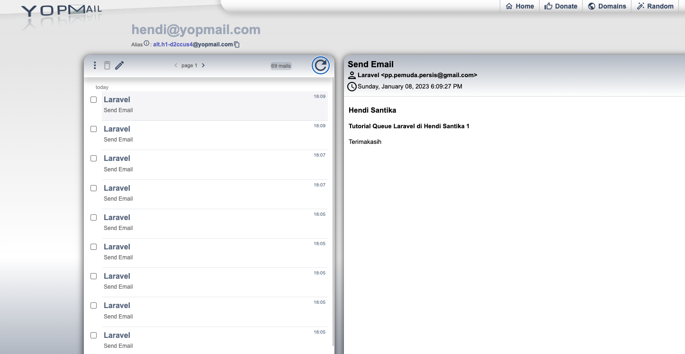

# Send Email using Laravel Queue

### Things todo list

1. Clone this repository: `git clone https://github.com/hendisantika/Laravel-Mail-Queue.git`
2. Navigate to the folder: `cd Laravel-Mail-Queue`
3. Run `cp .env.example .env` then put your database name & credentials.
4. Run `composer install`
5. Run `php artisan key:generate`
6. Run `php artisan migrate`
7. Run `php artisan serve`
8. Open your favorite browser: http://localhost:8000/send-email
9. Open another terminal then run `php artisan queue:listen`

### Image Screen shot

Send Email Form

Email

